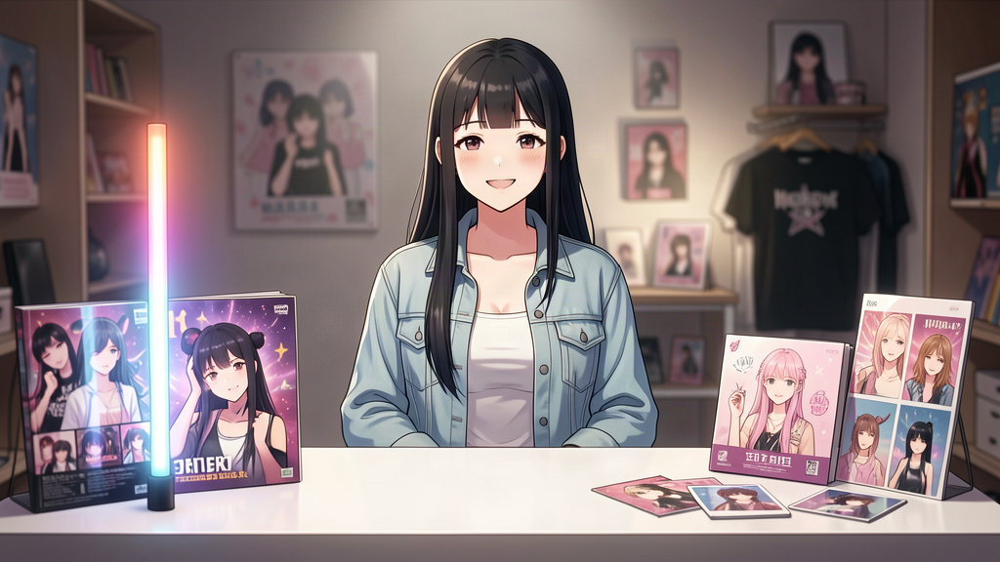
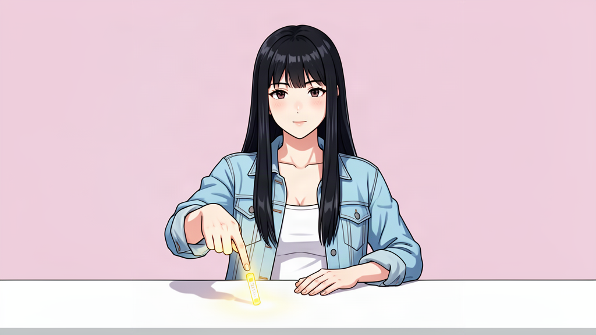
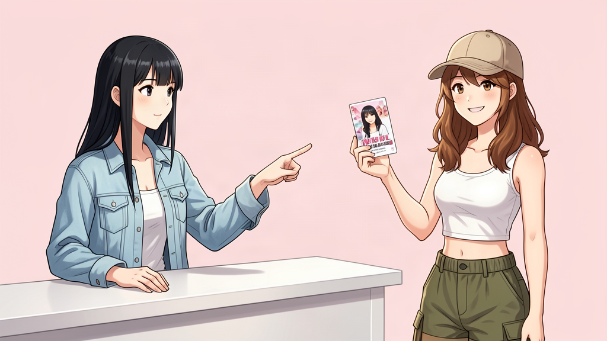
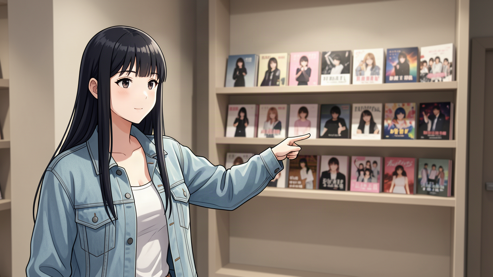

# 1A · Unit 3 — "이/그/저 거리 개념" 애니메이션 스토리보드

> 대본 연계: `tammy-scripts/unit3-animation-script.md` 의 **A2. 이/그/저 개념 (0:40–1:50)**
> 용도: FLUX3/영상 도구 가동 시 **시작 프레임(키프레임)** 으로 사용. 각 컷을 이어 영상 제작.
> 그림체: #4 FILM ANIME (영화급 애니) · 캐릭터: Glowsis 아란(f-01)·채아(f-02)
> 프레임 원본: `tammy-scripts/unit3-frames/shotN_*.png`

---

## 컷 구성 (대본 A2 → 5컷)

### SHOT 0 — 오프닝 (대본 0:40)

**아란**이 굿즈 부스 뒤에서 미소. 화면엔 응원봉/앨범/포토카드가 놓임.
🎙 내레이션: "오늘은 '이거 뭐예요?' — 이/그/저, 세 가지 '이것'을 배워요!"
→ 부스 + 캐릭터 셋업 컷.

### SHOT 1 — "이" = near me (가장 가까움)

**아란**이 손 바로 옆 카운터의 **응원봉 하나**를 가리킴.
🎙 "이 = this. 나에게 가장 가까운 것."
⚠️ 모델이 '이' 문자를 이미지에 넣음 → 최종은 문자 제거(오버레이 라벨은 편집에서).

### SHOT 2 — "그" = near you (듣는 사람 가까이)

**아란**(검은 머리)이 중간 거리의 **채아**(갈색 머리·모자)가 든 **포토카드**를 가리킴.
🎙 "그 = that. 듣는 사람에게 가까운 것."
✓ 두 캐릭터 구분 확인.

### SHOT 3 — "저" = far away (둘 다에게 먼)

**아란**이 멀리 뒤 선반의 **앨범들**을 가리킴. 깊이감 뚜렷.
🎙 "저 = that. 나와 너 둘 다에게 먼 것."
⚠️ 배경이 CD/DVD 매장처럼 보임 → 굿즈(앨범/포토카드)로 배경 수정 권장.

### SHOT 4 — 종합 (이/그/저 한 화면)

아란(왼쪽)·채아(오른쪽), 앞 응원봉(이) / 채아 포토카드(그) / 뒤 앨범(저) **세 거리 레이어**.
🎙 "이 → 그 → 저, 거리 순서예요. 그림으로 기억하세요!"
⚠️ 라벨 '적' 오류 + 깁버리시 텍스트 → 제거 필요.

---

## 연출 메모 (영상 제작 시)

| 항목 | 내용 |
|---|---|
| **전환** | SHOT 1→2→3: 같은 위치, 아란 손이 가리키는 대상만 멀어짐 (스무스) |
| **내레이션 음성** | 한국어, 아란 목소리로 차분하게 (Web TTS ko-KR rate 0.9) |
| **화면 오버레이** | 편집 단계에서 이/그/저 라벨 + 거리 아이콘을 **텍스트 오버레이**로 추가 (이미지에 박지 말 것) |
| **BGM** | 잔잔한 K-pop 인스트루멘탈 |
| **카메라** | SHOT 1~3에서 천천히 줌인, 가리키는 방향 따라 팬 |

## 프레임 텍스트 오류 (재생성 또는 편집으로 해결)
생성 모델이 한국어 라벨(이/그/저)을 이미지에 **텍스트로 박아버려** 일부 오류 발생:
- shot1: '이' 정상, shot4: 상단 '적'(저 아님) + 앨범 커버 깁버리시 텍스트
- 권장: 스토리보드 컷은 **문자 없는 장면**으로 재생성(이미지 생성시 라벨 금지 강조) → 최종 라벨은 영상 편집 오버레이로.
